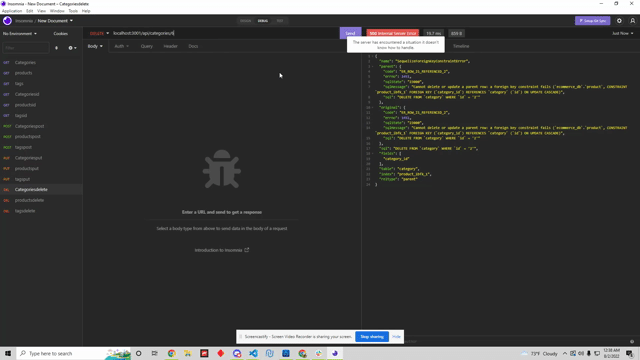

# e-commerce-back-end

# Description
 - This application is a command-line application that is run through Node.js. This application is the back end for an e-commerce platform, this repo has a preset folder with seeds for mysql.
 

# Installation
- Run an npm install to add all dependancies
- After run npm start
- Load up localhost:3001 in insomnia

## Table of Contents
- [Installation](#installation)

- [Usage](#usage)

- [Contribution](#contribution)

- [Tests](#tests)

- [License](#liscense)

- [Questions](#questions)

# Usage
 - Please refer to the below gifs 

# contributions
 - Sufyaan Vaidya

# Tests
 - Tests can be ran through Node.JS
 - Also can be tested with npm test

# License
 - [This repo is licensed by MIT](https://opensource.org/licenses/MIT)

# Contact and Questions
 - Github: SufyaanVaidya
 - Email: vaidyasufyaan@gmail.com

